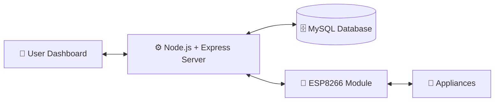

<div align="center">
# 🏠 Home Automation System
 
### Control your home from anywhere in the world 🌍
 
A complete **Home Automation System** built with **ESP8266, Node.js, MySQL**, and a sleek **Web Dashboard** — control and monitor your appliances remotely, in real time.
 
[](https://nodejs.org/)
[](https://www.mysql.com/)
[](https://www.espressif.com/)
[](LICENSE)
 
[](https://github.com/your-username/home-automation/stargazers)
[](https://github.com/your-username/home-automation/network/members)
[](https://github.com/your-username/home-automation/issues)
 
<br>
[✨ Features](#-features) •
[🛠 Tech Stack](#-tech-stack) •
[⚙️ Setup](#️-installation--setup) •
[🚀 Usage](#-usage) •
[🤝 Contributing](#-contributing)
 
</div>

---
 
## 🔎 Introduction
 
This project makes homes smarter by enabling **remote control of appliances over the internet**.
 
> The **ESP8266 Wi-Fi module** acts as a bridge between physical devices and the server, while the **Node.js backend** and **MySQL database** handle requests, logging, and data storage. A responsive web dashboard lets you toggle appliances, view live status, and review usage history — all from one place.
 
<div align="center">
| 📡 Connect | 🖥️ Control | 📊 Monitor |
|:---:|:---:|:---:|
| ESP8266 talks to your appliances | Dashboard sends commands instantly | MySQL logs every action with a timestamp |
 
</div>
---
## ✨ Features
 
<table>
<tr>
<td width="50%" valign="top">
### 🎛️ Core Controls
- 📡 **ESP8266 Integration** — controls appliances via Wi-Fi
- 🌐 **Web Dashboard** — clean, responsive UI for device management
- ⏱ **Real-Time Status** — instantly see what's ON or OFF
</td>
<td width="50%" valign="top">
### 🔐 Reliability & Security
- 📊 **Database Logging** — MySQL stores activity with date & time
- 👥 **User Management** — supports multiple users
- 🔒 **JWT-Ready Auth** — secure login for the dashboard
- 📧 **Email Notifications** — optional alerts for key events
</td>
</tr>
</table>
---
## 🛠 Tech Stack
 
<div align="center">
| Layer | Technology |
|---|---|
| 🔌 **Hardware** | ESP8266 Wi-Fi Module |
| 🎨 **Frontend** | HTML, CSS, JavaScript |
| ⚙️ **Backend** | Node.js + Express |
| 🗄️ **Database** | MySQL |
| 📶 **Communication** | HTTP (ESP8266 ⇆ Node.js Server) |
 
</div>
---
 
## 🏗 System Architecture
 

 
<details>
<summary><b>📄 View as plain-text diagram</b></summary>
```
[User Dashboard] ⇆ [Node.js + Express Server] ⇆ [MySQL Database]
                                   ⇅
                             [ESP8266 Module] ⇆ [Appliances]
```
 
</details>
---
 
## 📂 Project Structure
 
```
home-automation/
│
├── backend/        # Node.js + Express server files
├── frontend/       # HTML, CSS, JavaScript for dashboard
├── database/       # MySQL database scripts
├── esp8266/        # ESP8266 Arduino code
└── README.md       # Project documentation
```
 
---
## ⚙️ Installation & Setup
 
<details open>
<summary><b>🔧 Prerequisites</b></summary>
- ✅ Node.js & npm installed
- ✅ MySQL installed and configured
- ✅ Arduino IDE for ESP8266
</details>
<details open>
<summary><b>🖥️ Step-by-step setup</b></summary>
**1️⃣ Clone the repository**
```bash
git clone https://github.com/your-username/home-automation.git
cd home-automation
```
 
**2️⃣ Backend setup**
```bash
cd backend
npm install
npm start
```
 
**3️⃣ Database setup**
- Import the MySQL script from the `database/` folder
- Update database credentials in `backend/config.js`
**4️⃣ ESP8266 setup**
- Open the `esp8266/` code in Arduino IDE
- Update Wi-Fi credentials and server IP
- Upload the code to your ESP8266 board
**5️⃣ Frontend setup**
- Open `frontend/index.html` in your browser
- The dashboard should now connect with your backend 🎉
</details>
---
 
## 🚀 Usage
 
```
1. Open the web dashboard in your browser
2. Toggle appliances ON/OFF with a single click
3. Watch real-time device status update instantly
4. Browse logs to review past activity
```
 
---
 
## 🔮 Future Enhancements
 
- [ ] 📱 Native **mobile app** for easier control
- [ ] ⚡ **WebSocket** support for true real-time communication
- [ ] 🗣️ **Google Assistant / Alexa** voice control integration
- [ ] 🔋 **Energy monitoring** for connected appliances
---

## 🤝 Contributing
 
Contributions are what make the open-source community amazing. Any contributions are **greatly appreciated**! 💙
 
1. 🍴 Fork the repository
2. 🌿 Create your feature branch (`git checkout -b feature/AmazingFeature`)
3. 💾 Commit your changes (`git commit -m 'Add some AmazingFeature'`)
4. 📤 Push to the branch (`git push origin feature/AmazingFeature`)
5. 🔁 Open a Pull Request
<div align="center">
---
 
### ⭐ If you like this project, consider giving it a star!
 
**Made with ❤️ for smarter homes**
 
</div>
